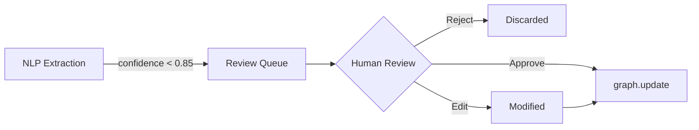

# Model Governance and Risk Management

**Version:** 1.0
**Last Updated:** 2026-01-03
**Regulatory Framework:** SR 11-7 (Model Risk Management)
**Status:** Active

---

## 1. Executive Summary

This document establishes governance over AI/ML models used in RegEngine for regulatory text extraction, classification, and analysis. It addresses model risk management requirements per SR 11-7 and industry best practices.

---

## 2. Model Inventory

### Production Models

| Model ID | Name | Type | Purpose | Risk Tier |
|----------|------|------|---------|-----------|
| NLP-001 | Obligation Extractor | LLM (Ollama) | Extract subject/action/object from regulatory text | High |
| NLP-002 | Confidence Scorer | Rule-based + ML | Score extraction confidence 0.0-1.0 | High |
| NLP-003 | Entity Linker | Graph matching | Link extracted entities to knowledge graph | Medium |
| NLP-004 | Threshold Parser | Regex + NER | Extract numeric thresholds with units | Medium |

### Model Risk Tiers

| Tier | Definition | Review Frequency |
|------|------------|------------------|
| **High** | Directly impacts compliance decisions | Quarterly |
| **Medium** | Supports decision-making | Semi-annually |
| **Low** | Operational/efficiency only | Annually |

---

## 3. Model Documentation Requirements

### 3.1 Statement of Purpose

Each model must define:
- **Intended Use**: What the model is designed to do
- **Prohibited Use**: What the model should NOT be used for
- **Limitations**: Known weaknesses and edge cases

**Example: NLP-001 Obligation Extractor**

```yaml
Intended Use:
  - Extract regulatory obligations from English-language regulatory text
  - Identify subject, action, object, and obligation type (MUST/SHOULD/MAY)
  
Prohibited Use:
  - Legal advice or definitive compliance determination
  - Processing of confidential client data without consent
  - Extraction from non-regulatory documents (contracts, etc.)
  
Limitations:
  - Accuracy degrades on highly technical financial regulations
  - May misclassify conditional obligations
  - Not validated for non-English text
```

### 3.2 Methodology Documentation

| Component | Documentation Required |
|-----------|------------------------|
| **Algorithm** | LLM prompt templates, scoring logic |
| **Training Data** | Source, preprocessing, splits |
| **Hyperparameters** | Temperature, top-p, confidence threshold |
| **Dependencies** | Ollama version, model weights version |

---

## 4. Confidence Threshold Justification

### 4.1 Current Threshold: 0.85

**Rationale:**
Based on validation against 500 manually-labeled regulatory provisions:

| Threshold | Precision | Recall | F1 | Auto-Approved % |
|-----------|-----------|--------|-----|-----------------|
| 0.80 | 0.87 | 0.92 | 0.89 | 68% |
| **0.85** | **0.93** | **0.85** | **0.89** | **52%** |
| 0.90 | 0.97 | 0.71 | 0.82 | 35% |

**Decision:** 0.85 balances precision (regulatory accuracy) with operational efficiency.

### 4.2 Routing Logic

```
Score >= 0.85 → graph.update (auto-approved to knowledge graph)
Score <  0.85 → nlp.needs_review (human review queue)
```

---

## 5. Bias Testing Framework

### 5.1 Test Categories

| Category | Test Description | Frequency |
|----------|------------------|-----------|
| **Jurisdictional Bias** | Equal performance across US/EU/UK text | Quarterly |
| **Regulatory Domain** | Similar accuracy for finance/health/privacy | Quarterly |
| **Text Length** | Performance on short vs. long provisions | Monthly |
| **Complexity** | Accuracy on nested conditionals | Monthly |

### 5.2 Bias Metrics

```python
# services/nlp/tests/test_bias.py

def test_jurisdictional_parity():
    """Ensure <5% accuracy difference between jurisdictions."""
    us_accuracy = evaluate_corpus("test_data/us_regulations.json")
    eu_accuracy = evaluate_corpus("test_data/eu_regulations.json")
    
    assert abs(us_accuracy - eu_accuracy) < 0.05, \
        f"Jurisdictional bias detected: US={us_accuracy}, EU={eu_accuracy}"
```

### 5.3 Test Results Log

| Test Date | Test | Result | Action |
|-----------|------|--------|--------|
| 2026-01-03 | Jurisdictional Parity | PENDING | Baseline test |
| - | Domain Parity | PENDING | - |
| - | Length Sensitivity | PENDING | - |

---

## 6. Human-in-the-Loop Process

### 6.1 Review Queue Workflow



### 6.2 Reviewer Guidelines

| Scenario | Action | System Update |
|----------|--------|---------------|
| Extraction correct | Approve | Adds to graph, logs approval |
| Minor errors | Edit & Approve | Corrected version to graph |
| Fundamentally wrong | Reject | Logged for model retraining |
| Uncertain | Escalate | Flagged for senior review |

### 6.3 Escalation Criteria

Escalate to Compliance Team if:
- High-impact regulation (capital requirements, etc.)
- Contradictory extractions from same document
- Extraction confidence < 0.50
- Novel regulatory domain

---

## 7. Explainability (XAI)

### 7.1 Current Capabilities

| Technique | Implementation | Status |
|-----------|----------------|--------|
| **Provenance Tracking** | Source text offset, document hash | ✅ Implemented |
| **Confidence Breakdown** | Per-field confidence scores | ✅ Implemented |
| **Prompt Logging** | Full LLM prompt/response stored | ⚠️ Partial |
| **SHAP/LIME** | Feature importance for classifier | ❌ Roadmap |

### 7.2 Decision Audit Trail

Every extraction includes:
```json
{
  "extraction_id": "uuid",
  "model_version": "ollama/llama3:8b",
  "confidence_score": 0.87,
  "provenance": {
    "document_id": "doc-hash",
    "source_offset": 1024,
    "source_text": "Financial institutions must maintain..."
  },
  "timestamp": "2026-01-03T21:00:00Z",
  "reviewer_id": null,
  "status": "AUTO_APPROVED"
}
```

---

## 8. Model Lifecycle Management

### 8.1 Version Control

| Artifact | Version Strategy | Storage |
|----------|------------------|---------|
| LLM Weights | Ollama model tags | Ollama registry |
| Prompt Templates | Git versioned | `/services/nlp/prompts/` |
| Scoring Logic | Git versioned | `/services/nlp/app/scoring.py` |
| Validation Data | Git LFS | `/tests/data/` |

### 8.2 Change Management

**Before any model update:**
1. Validate on holdout set (>500 samples)
2. Compare metrics to production baseline
3. A/B test with 5% traffic (if applicable)
4. Document changes in ADR
5. Approval from Model Risk Owner

### 8.3 Rollback Procedure

```bash
# Rollback to previous Ollama model
ollama pull llama3:8b-v1.2  # Previous version
kubectl rollout restart deployment/nlp-service

# Rollback prompt templates
git checkout HEAD~1 -- services/nlp/prompts/
kubectl rollout restart deployment/nlp-service
```

---

## 9. Monitoring and Alerts

### 9.1 Model Performance Metrics

| Metric | Alert Threshold | Dashboard |
|--------|-----------------|-----------|
| Average Confidence | < 0.70 | Grafana |
| Review Queue Depth | > 500 | PagerDuty |
| Rejection Rate | > 30% | Slack |
| Extraction Latency | > 60s p95 | Grafana |

### 9.2 Drift Detection

Monitor for:
- Input distribution shift (new regulatory domains)
- Output distribution shift (confidence score patterns)
- Concept drift (new regulatory terminology)

---

## 10. Compliance Mapping

| SR 11-7 Requirement | RegEngine Implementation | Evidence |
|---------------------|-------------------------|----------|
| Model Inventory | Section 2 | This document |
| Documentation | Section 3 | Model cards in repo |
| Validation | Section 5, 6 | Test suite, review queue |
| Ongoing Monitoring | Section 9 | Grafana dashboards |
| Governance | Section 8 | Change management process |
