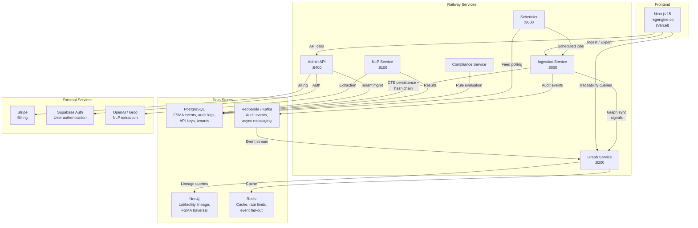

# RegEngine Architecture (FSMA-First)

Last updated: March 28, 2026

> **Note (2026-04-18):** The 6-service topology diagram below reflects
> code-level **router boundaries**, not deploy boundaries. Production
> runs a single consolidated monolith. See
> [`CONSOLIDATION.md`](CONSOLIDATION.md) for the current deployed shape.

## Purpose

This document describes the architecture that is actually implemented in this repository and used for the current FSMA-first product wedge.

## Product Scope

- Primary domain: FDA FSMA 204 traceability.
- Primary outcomes: CTE/KDE capture, lot traceability, and 24-hour FDA export readiness.
- Primary workflow: supplier onboarding -> event ingestion -> tamper-evident persistence -> graph traversal -> export.

## System Architecture Diagram



## Deployment Topology

Current deployment references in this repo:

- Frontend: Vercel (`regengine.co`) via Next.js 15 (`frontend/`).
- Backend services: Railway-hosted FastAPI services (`services/*`).
- Stateful stores: PostgreSQL, Neo4j, Redis.

See also:

- `README.md`
- `docs/FSMA_RAILWAY_DEPLOYMENT.md`
- `docs/ENV_SETUP_CHECKLIST.md`

## Deployment Routing

### Production (Railway)
Railway's native routing is the production source of truth. Each service runs as an independent Railway service with:
- Auto-TLS termination and per-service domains (e.g., `regengine-production.up.railway.app`)
- Internal service-to-service communication via Railway's private networking
- No nginx reverse proxy — Railway handles load balancing and routing natively

| Service | Public Domain | Role |
|---------|--------------|------|
| RegEngine (admin) | regengine-production.up.railway.app | Admin API, billing, tenant management |
| believable-respect (ingestion) | believable-respect-production-2fb3.up.railway.app | CTE ingestion, FDA export, webhooks |
| intelligent-essence (compliance) | intelligent-essence-production.up.railway.app | Compliance checks, rules engine |
| Graph | Internal only | Neo4j graph queries, FSMA trace |
| NLP | Internal only | Entity extraction, document analysis |
| Scheduler | Internal only | APScheduler-based cron jobs (no HTTP) |

### Local Development / Self-Hosted
`infra/gateway/nginx.conf` provides a unified reverse proxy for local development and self-hosted deployments. It consolidates all services behind a single port with:
- Rate limiting (10r/s API, 20r/s FSMA, 5r/s auth)
- Security headers (CSP, HSTS, X-Frame-Options)
- Request correlation (X-Request-ID injection)
- Per-endpoint timeout tuning (10s-180s)

## Core Service Map

| Service | Entry Point | Default Port | Primary Responsibility |
|---|---|---:|---|
| Admin API | `services/admin/main.py` | 8400 | tenant/auth/user flows, onboarding support, API keys |
| Ingestion Service | `services/ingestion/main.py` | 8000/8002 | FSMA event ingest, CSV import, FDA export endpoints |
| Graph Service | `services/graph/app/main.py` | 8200 | FSMA traceability graph, recall/metrics/compliance graph endpoints |
| NLP Service | `services/nlp/main.py` | 8100 | extraction and confidence-gated processing |
| Scheduler | `services/scheduler/main.py` | 8600 | scheduled FDA/regulatory feed polling and job orchestration |

Note: FSMA export endpoints are implemented in ingestion routers.

## Shared Bootstrap Pattern

Service entrypoints use the shared bootstrap from `services/shared/paths.py`:

- `ensure_shared_importable()` adds project/service/shared paths for consistent imports.
- This keeps service startup consistent across local, pytest, and Docker contexts.

When creating or refactoring service entrypoints, follow this pattern instead of ad hoc path hacks.

## FSMA Data Flow (Implemented)

1. Event ingest: `POST /api/v1/webhooks/ingest`
   - Router: `services/ingestion/app/webhook_router_v2.py`
2. Persistence + integrity chain
   - Module: `services/shared/cte_persistence.py`
   - Persists event, KDEs, hash-chain links, and compliance alerts in one transaction.
3. Graph sync handoff
   - Ingestion publishes sync signals for downstream graph updates.
4. Traceability queries
   - Graph FSMA routers under `services/graph/app/routers/fsma/`.
5. FDA export + verification
   - Router: `services/ingestion/app/fda_export/router.py`
   - Endpoints include export, export history, and export verification.

## Data Stores

- PostgreSQL
  - Durable FSMA event persistence and export audit logging.
  - Schema/migrations include FSMA persistence assets under `migrations/` and service migrations.
- Neo4j
  - Lot/facility/event lineage and FSMA traversal queries.
- Redis
  - Caching, rate-limit support, and event fan-out support.

## Auth, Tenant Isolation, and Contracts

- API key contract: `X-RegEngine-API-Key`.
- Shared auth dependency: `services/shared/auth.py` (`require_api_key`).
- Request middleware and tenant context patterns live in `services/shared/middleware/`.

## Testing and Verification Commands

From repo root:

```bash
python -m pytest tests -q
python -m pytest services/<service>/tests -q
bash scripts/test-all.sh --quick
```

From `frontend/`:

```bash
npm run lint
npm run test:run
npm run build
```

## Non-Goals

The architecture documentation must not include speculative systems, fictional phases, or unimplemented infrastructure.

If a claim cannot be traced to a file, endpoint, migration, or test in this repository, it does not belong in this document.
