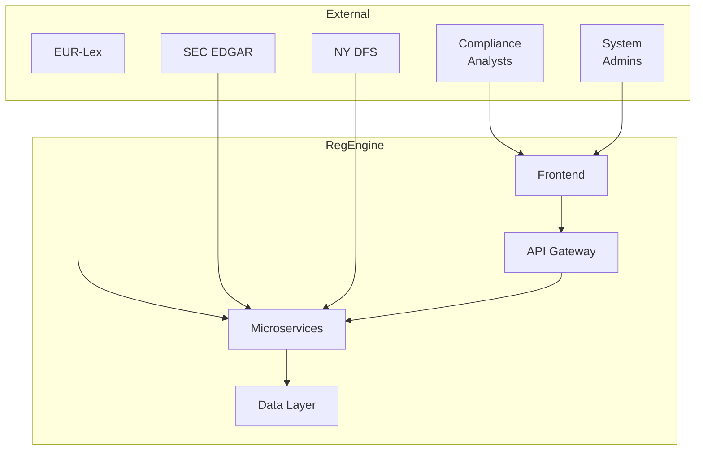

# RegEngine Architecture Documentation

## Overview

This directory contains the formal architecture documentation for RegEngine following the C4 model and Arc42 template.

## Contents

| Document | Description |
|----------|-------------|
| [C4 Context](c4-context.md) | System context - users and external systems |
| [C4 Containers](c4-containers.md) | High-level container/service breakdown |
| [C4 Components](c4-components.md) | Per-service component details |
| [decisions/](decisions/) | Architecture Decision Records (ADRs) |

## Quick Reference

## Principles

1. **Event-Driven** - Kafka-based async processing
2. **Multi-Tenant** - Tenant isolation at database level
3. **Human-in-the-Loop** - Low-confidence extractions require review
4. **Regulatory First** - Audit trails for all operations
