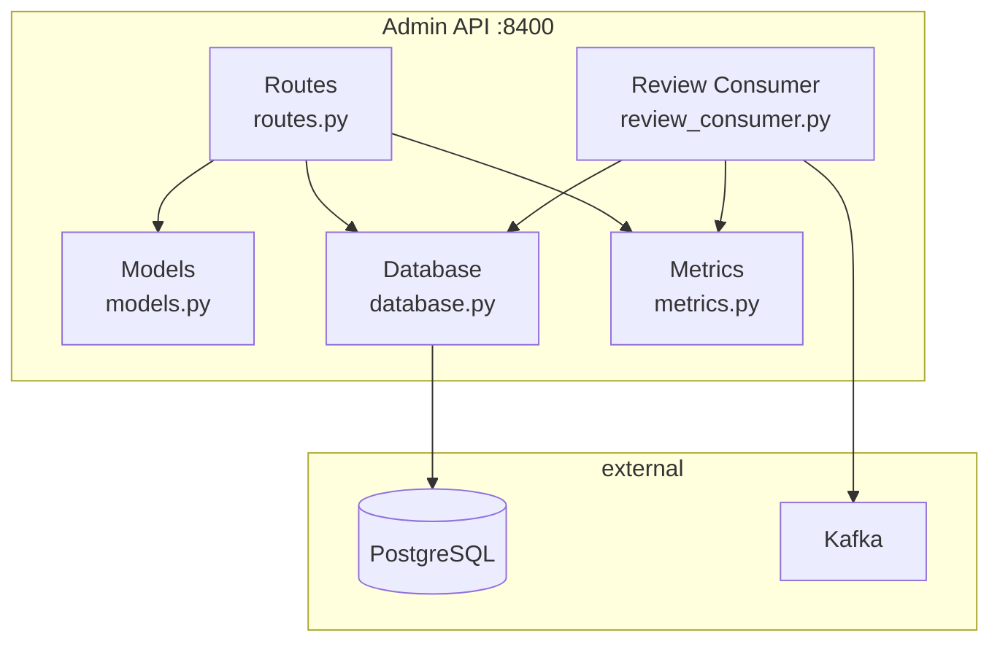
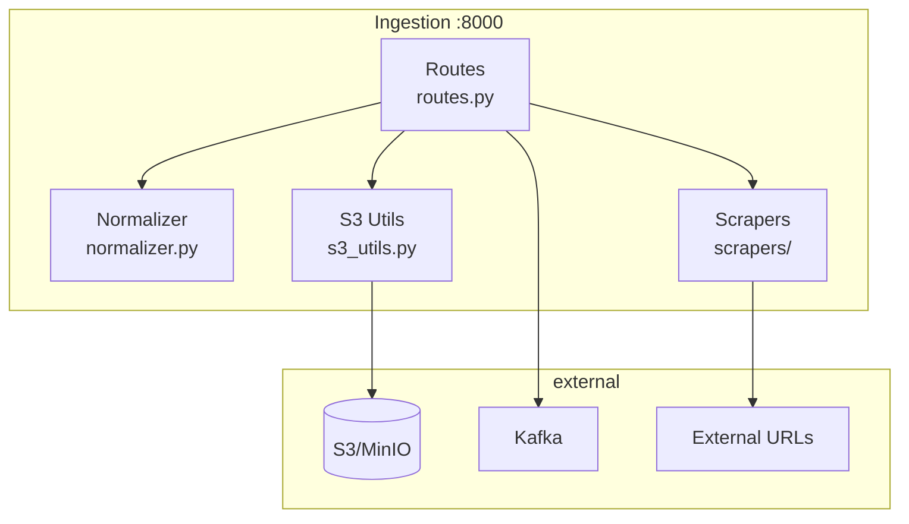
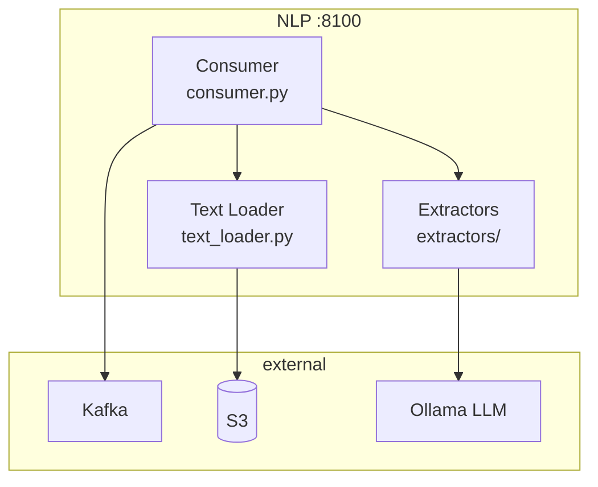
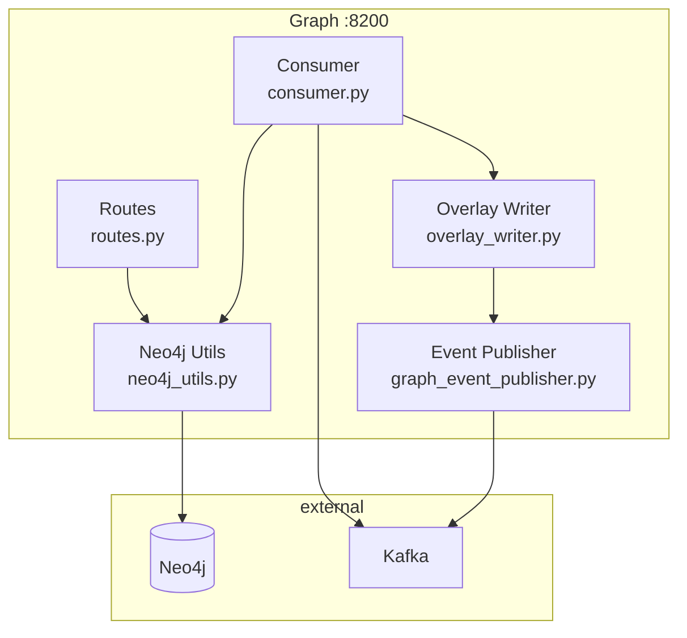
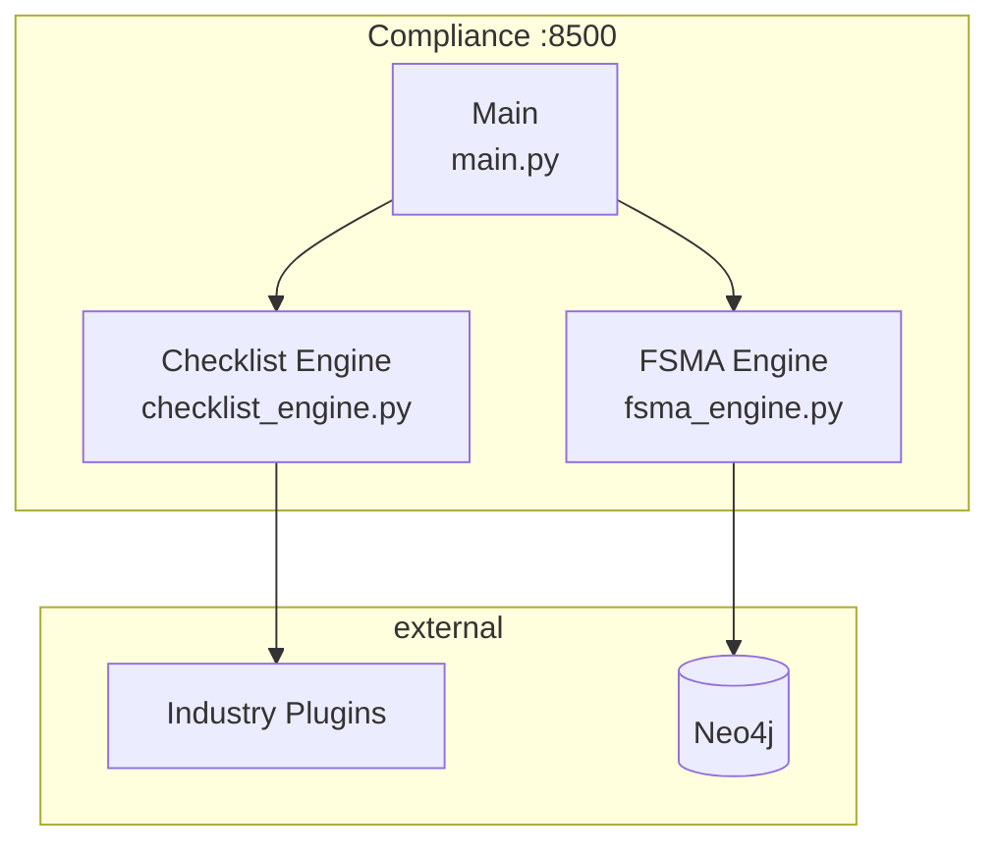
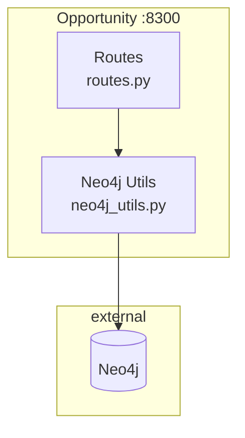

# C4 Model: Component Diagram (Level 3)

## Admin Service Components

| Component | File | Responsibility |
|-----------|------|----------------|
| **Routes** | `routes.py` | API endpoints for tenants, keys, review |
| **Models** | `models.py` | Pydantic models, TenantContext |
| **Database** | `database.py` | SQLAlchemy session management |
| **Metrics** | `metrics.py` | HallucinationTracker, Prometheus |
| **Review Consumer** | `review_consumer.py` | Kafka consumer for low-confidence items |

---

## Ingestion Service Components

| Component | File | Responsibility |
|-----------|------|----------------|
| **Routes** | `routes.py` | `/ingest/url`, `/scrape/*` endpoints |
| **Normalizer** | `normalizer.py` | PDF/HTML extraction, hashing |
| **S3 Utils** | `s3_utils.py` | Raw/normalized document storage |
| **Scrapers** | `scrapers/` | NYDFS, CPPA, generic state adapters |

---

## NLP Service Components

| Component | File | Responsibility |
|-----------|------|----------------|
| **Consumer** | `consumer.py` | Kafka consumer, confidence routing |
| **Extractors** | `extractors/` | NYDFS, SEC, generic extractors |
| **Text Loader** | `text_loader.py` | S3 fetch, PDF/HTML parsing |

---

## Graph Service Components

| Component | File | Responsibility |
|-----------|------|----------------|
| **Routes** | `routes.py` | `/v1/provisions/*` queries |
| **Consumer** | `consumer.py` | `graph.update` Kafka consumer |
| **Neo4j Utils** | `neo4j_utils.py` | Driver, upsert operations |
| **Overlay Writer** | `overlay_writer.py` | Tenant controls, mappings |
| **Event Publisher** | `graph_event_publisher.py` | Audit events to Kafka |

---

## Compliance Service Components

| Component | File | Responsibility |
|-----------|------|----------------|
| **Main** | `main.py` | FastAPI app, endpoints |
| **Checklist Engine** | `checklist_engine.py` | Plugin loading, validation |
| **FSMA Engine** | `fsma_engine.py` | Food safety assessment |

---

## Opportunity Service Components

| Component | File | Responsibility |
|-----------|------|----------------|
| **Routes** | `routes.py` | `/opportunities/arbitrage`, `/opportunities/gaps` |
| **Neo4j Utils** | `neo4j_utils.py` | Cypher queries for comparison |
