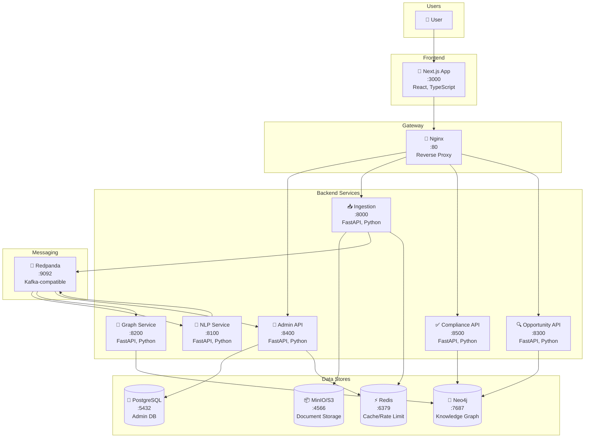

# C4 Model: Container Diagram (Level 2)

## Diagram

## Container Descriptions

### Frontend Layer

| Container | Technology | Responsibility |
|-----------|------------|----------------|
| **Next.js App** | React 18, TypeScript, Tailwind | User interface, SSR, API routes |

### API Gateway

| Container | Technology | Responsibility |
|-----------|------------|----------------|
| **Nginx** | Alpine | Request routing, TLS termination, load balancing |

### Backend Services

| Container | Port | Technology | Responsibility |
|-----------|------|------------|----------------|
| **Admin API** | 8400 | FastAPI | Tenant management, API keys, review queue |
| **Ingestion** | 8000 | FastAPI | URL fetching, normalization, S3 storage |
| **NLP Service** | 8100 | FastAPI | Entity extraction, confidence scoring |
| **Graph Service** | 8200 | FastAPI | Neo4j ingestion, provision queries |
| **Compliance API** | 8500 | FastAPI | Checklist validation, FSMA assessment |
| **Opportunity API** | 8300 | FastAPI | Arbitrage detection, gap analysis |

### Messaging

| Container | Technology | Topics |
|-----------|------------|--------|
| **Redpanda** | Kafka-compatible | `ingest.normalized`, `graph.update`, `nlp.needs_review`, `graph.audit` |

### Data Stores

| Container | Technology | Data |
|-----------|------------|------|
| **PostgreSQL** | v15 | Tenants, API keys, review queue |
| **Neo4j** | v5.24 | Provisions, jurisdictions, thresholds |
| **MinIO/S3** | S3-compatible | Raw documents, normalized JSON |
| **Redis** | v7 | Rate limiting, session cache |

## Communication Patterns

1. **Sync (HTTP)**: Frontend → Gateway → Services
2. **Async (Kafka)**: Ingestion → NLP → Graph/Admin
3. **Query (Bolt/SQL)**: Services → Neo4j/PostgreSQL
