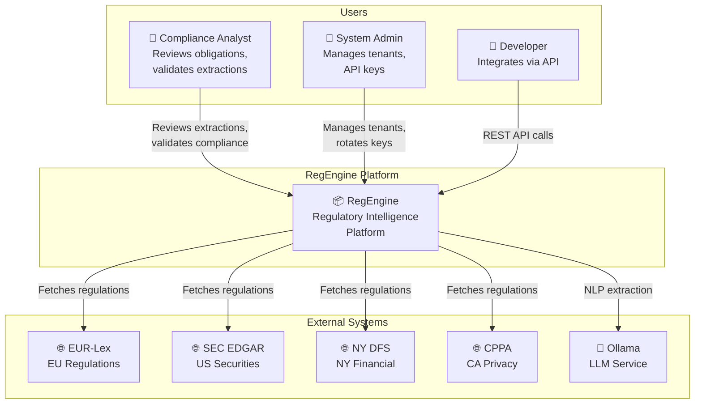

# C4 Model: System Context (Level 1)

## Diagram

## Context Description

### Users

| Actor | Role | Interactions |
|-------|------|--------------|
| **Compliance Analyst** | Reviews extracted obligations, validates against checklists | UI: Review queue, Compliance page, Opportunities |
| **System Admin** | Manages multi-tenant configuration | UI: Admin page, API key management |
| **Developer** | Integrates RegEngine into workflows | REST API: Ingestion, Query, Webhooks |

### External Systems

| System | Integration | Data Flow |
|--------|-------------|-----------|
| **EUR-Lex** | HTTP scraping | Inbound: EU regulations (DORA, MiCA, etc.) |
| **SEC EDGAR** | HTTP scraping | Inbound: US securities regulations |
| **NY DFS** | HTTP scraping | Inbound: NY financial regulations |
| **CPPA** | HTTP scraping | Inbound: California privacy regulations |
| **Ollama** | REST API | Bidirectional: NLP extraction requests/responses |

## Key Relationships

1. **RegEngine → External Regulatory Sources**: Pull-based ingestion triggered by user or scheduler
2. **RegEngine → Ollama**: Synchronous LLM calls for entity extraction
3. **Users → RegEngine**: HTTPS with API key authentication
4. **RegEngine → Users**: Real-time UI updates, webhook notifications (future)

## Quality Attributes at this Level

- **Availability**: Platform must be accessible 99.9% uptime
- **Security**: All external communications over TLS, API key auth
- **Auditability**: All user actions logged with correlation IDs
