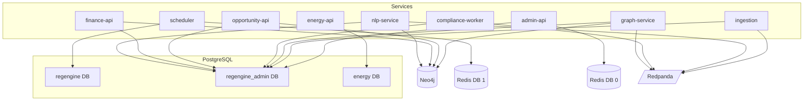

# Cross-Database Context Dependencies

> **Purpose:** Map which RegEngine services connect to which data stores,
> which driver they expect, and who owns schema migrations.

## PostgreSQL Databases

| Database | Service(s) | Driver | Purpose |
|----------|-----------|--------|---------|
| `regengine` | scheduler | `psycopg2` (sync) | Job store, advisory locks for leader election |
| `regengine_admin` | admin-api, ingestion, graph, compliance-worker, opportunity-api, nlp-service, finance-api | `psycopg` (async) / `asyncpg` | API keys, tenants, audit logs, review queues, entertainment PCOS data |
| `energy` | energy-api | `psycopg2` (sync) | Utility benchmarks, energy compliance data |

### Migration Ownership

- **regengine_admin** — Admin service owns Alembic migrations (`services/admin/alembic/`)
- **regengine** — Scheduler service owns its table creation (`services/scheduler/app/models.py`)
- **energy** — Energy service owns its own schema (`services/energy/app/models.py`)

### Cross-Database Gotchas

> [!WARNING]
> Several services override `DATABASE_URL` in `docker-compose.yml` to point at
> `regengine_admin` instead of `regengine`. The `ENTERTAINMENT_DATABASE_URL`
> also points to `regengine_admin` currently. Changing the admin DB schema
> can break ingestion, graph, compliance, and entertainment services.

- **Ingestion** uses `postgresql+psycopg://...regengine_admin` (overridden from common)
- **Graph** uses `postgresql+asyncpg://...regengine_admin` (different async driver)
- **Compliance Worker** uses `postgresql+psycopg://...regengine_admin`
- **Scheduler** uses plain `postgresql://...regengine` (its own DB, not admin)

---

## Neo4j

| Service | Connection | Purpose |
|---------|-----------|---------|
| graph-service | `bolt://neo4j:7687` | Regulatory fact graph, lineage chains, supply chain nodes |
| opportunity-api | `bolt://neo4j:7687` | Opportunity scoring from graph data |
| finance-api | `bolt://neo4j:7687` | Financial regulation graph queries |
| nlp-service | `bolt://neo4j:7687` | Entity extraction target storage |

### Tenant Isolation

Neo4j uses **database-per-tenant** isolation. Each tenant's data lives in a
separate Neo4j database, selected at connection time via the tenant ID header.

---

## Redis

| Service | Connection | DB Index | Purpose |
|---------|-----------|----------|---------|
| All (via common) | `redis://redis:6379/0` | 0 | Rate limiting, caching |
| scheduler | `redis://redis:6379/1` | 1 | Job locking, heartbeats |

---

## Kafka / Redpanda

| Topic | Producer | Consumer | Purpose |
|-------|----------|----------|---------|
| `ingest.normalized.v2` | ingestion-service | nlp-service, compliance-worker | Normalized documents for downstream processing |
| `nlp.extracted` | nlp-service | graph-service | Extracted entities and regulatory facts |
| `ingest.dlq` | ingestion-service | (manual review) | Dead-letter queue for failed ingestion |
| `nlp.dlq` | nlp-service | (manual review) | Dead-letter queue for failed NLP processing |

---

## Dependency Graph

